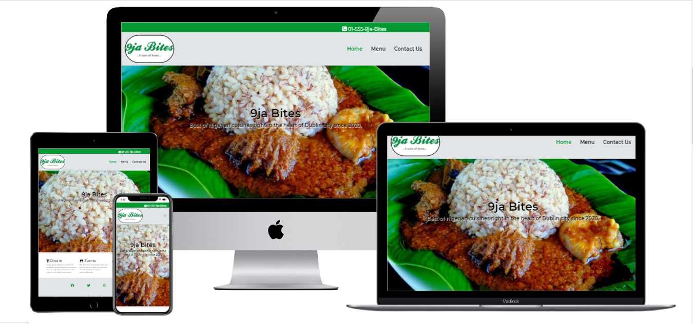

<!--Project brand-->

Live website can be found [here](https://oluwafemiawosanya.github.io/MS1-9JA-Bites/)
<!--Project Name-->
# 9ja-Bites
**version 1.0.0.**

A website for a Nigerian restaurant in Dublin, Ireland. The website highlights services render by the restaurant,menu gallery and clear path to making contacts with the restaurant for bookings and orders via the Contact page.
To further make contacting the restaurant easier for the customers, there is  a call link on the top bar, which replicates on all pages and of course social media links on the footer which equally appears on all pages.
The website is targeted at the Nigerian audience and lovers of traditional Nigerian food resident in Ireland or visiting to bringing them to the door.

**Business goals of this website**
* Build brand awareness
* Showcase varieties of food menu available
* Showcase other add on services the business provides
* Drive sales via the call link in the Top bar, Contact form and social media links.
* Simple and user friendly UX to keep clients on the website and make conversion time short.

**Customer goals for this website**
* Looking to get traditional Nigerian food in Dublin and environs.
* Have a need to cater for small or large gathering
* Looking to host a few friends on a Friday evening
* Simple and easy path to contact and locate

<!--UX-->
## UX
**Web layout**

The Nigerian national colour is green and white, hence the choice of green and white colour on the website with grey colour as contrast.
Most of the texts are black and white in some cases for better visibility.

**Prospective website users**

The ideal visitors to this website are;

* Residents of Ireland looking for a Nigerian restaurant to dine in and hangout
* Residents of Ireland looking to hire catering for their events
* Visitors to Ireland looking for a Nigerian restaurant to dine in and hangout

Though there are other restaurants serving Nigerian meals in Dublin, they often drive sales by words of mouth with little or no online presence.
9ja-Bites will take advantage of its online presence to drive more sales and be open to residents and visitors alike for business.

**Wireframe**

[Home](https://github.com/OluwafemiAwosanya/MS1-9JA-Bites/blob/e18bef804021b65552eea10a757f0d8e35d80081/assets/wireframe/Hp.pdf)

[Menu](https://github.com/OluwafemiAwosanya/MS1-9JA-Bites/blob/0317d68cc88daa47f69657845a80773b7182ae4a/assets/wireframe/Mp.pdf)

[Contact Us](https://github.com/OluwafemiAwosanya/MS1-9JA-Bites/blob/e18bef804021b65552eea10a757f0d8e35d80081/assets/wireframe/CUp.pdf)

<!--Features-->
## Features

The website has a clean user friendly layout with all essential information displayed. Each page features a responsive top-bar with a telephone link, an equally responsive navigation bar
with the logo (linked to home page) top-left and navbar menu top-right. Each page equally has a footer that display social media icons that links to 4 social media accounts of the restaurant and on the bottom of the footer is the copyright information. 

### Home

* The Home page features a static hero image with welcoming cover texts introducing the business.
* Below the static image, different services rendered by the business are laid out in 3 responsive columns for optimum visibity on all devices.

### Menu

* The Menu page features gallery of menu served by the business with description. The responsive layout is 1 column on mobile,
2 columns on tablets, 3 columns on large screens and 4 colums on extra-large screens.

### Contact Us

* The Contact Us page features the business address with google map embedded via map-marker icon for easy location.
* Below the business address is the business telephone number with a link (for good mobile experience).
* A contact form for business enquiries, orders or reservations with the following fields;

    * Client's name 
    * client's email address
    * A text box to leave details of enquiries,orders or reservations.

* A "Submit" button at the bottom of the contact form.

<!--Technologies Used-->
## Technologies Used
* HTML5
* CSS3
* Bootstrap 4.5.0.
* Google Fonts
* Font Awesome 4.7.0.
* jQuery
* Git
* GitPod
* GitHub
* Chrome DevTools
* Google Maps API   
* Balsamiq wireframe 
* Lighthouse
* Freelogoservices.com  
* Validator.w3.org
* jigsaw.w3.org       

<!--Testing-->
## Testing

### Functional Testing

* All the links have been checked and confirmed to be working fine
* HTML and CSS codes have been validated with [HTML Validator](https://validator.w3.org/) and [CSS Validator](https://jigsaw.w3.org/css-validator/) respectively
* I have used chrome DevTools to simulate the website usabilty on different devices
* Further engage friends and family to test and provide feedback on all features not leaving out Navigation experience and typography

### Usability Testing

1. As a user, I want to Navigate the website and see what the business is all about
   * User lands on the landing page,see the intro texts, scrolls down the page and see all the services the business renders

1. As a user, I want to Navigate the website and see what food the business has on the menu
   * User lands on the landing page, click Menu tab from Navbar and Menu page display. The logo image leads back to the Home page
1. As a user, I want to contact the business for order/reservation/enquiry
   * User lands on the landing page, click on the Contact Us page, Contact Us page display business address,telephone and contact form. The logo image leads back to Home page

Overall, the website has been designed in a way that a user can contact and connect with the business via any page they are on ,with a choice of phone call at the top bar and social media links on the footer.

### Compatibility Testing

* I tested the website on the following browsers;
    * Chrome
    * Edge
    * Firefox
    * Safari

The user experience on all listed browsers is satisfying

### Bugs

* Menu gallery loaded well in dev environment but failed to load when deployed to live environment.
    * Issue caused by a forward slash "/" at the start of image path acceptable to gitPod but not acceptable to gitHub.
    * img path modified and gallery loaded fine.

<!--Deployment-->
## Deployment

### GitHub pages

The website has been deployed with the following steps;

* Log in on GitHub
* Click on the repository you need to deploy
* Go on "Settings"
* Scroll down the page until you find the "GitHub pages" section
* On "source" click on "none"
* Select "master branch" from the dropdown menu
* The page re-loads automatically
* Scroll down again to "GithHub pages" section
* You will now find a link that says "Your site is published at ..."

### Fork the code 

To work on this code on your own, follow these steps;

* Log in on GitHub
* Find the project repository
* On the top-right of the page, you will find a button with the name "Fork"
* Click on it and it will automatically fork the code to your GitHub

### Local Clone

To make a local clone of this website, follow these steps;

* Log in on GitHub
* Find the Project repository
* Locate a button with the name "code"
* Click on the "code" button
* On the dropdown selection,you will find a link to clone the code with HTTPS
* Copy the HTTPS link
* Open Git bash
* Open the directory you want to work on the cloned code 
* Type git clone followed by the previously copied HTTPS link
* Press Enter

<!--Credits-->
## Credits
### Content

* I have created all the texts on this website myself
* I used www.freelogoservices.com to create the 9ja-Bites logo

### Media

* All the photos used on this website were obtained from  random google search results

### Code

* CSS code for text shadow on Home page was taken from w3schools.com, I tweaked it further to suit my project.

### Acknowledgements

* My inspiration for this project comes from the size of the Nigerian community in Ireland (200,000 plus), with more than half residing in Dublin and environs.
* My mentor Spencer Barriball has been of immense support, the top-bar telephone link was his idea.
* Jim Morel and Oliver Medley for there support via Slack.
* Drew Ryan and Traversy media Youtube channels helped guide a few of my decisions in the process of building this website.

<!--Copyright-->
## Copyright
© 9ja-Bites 2020